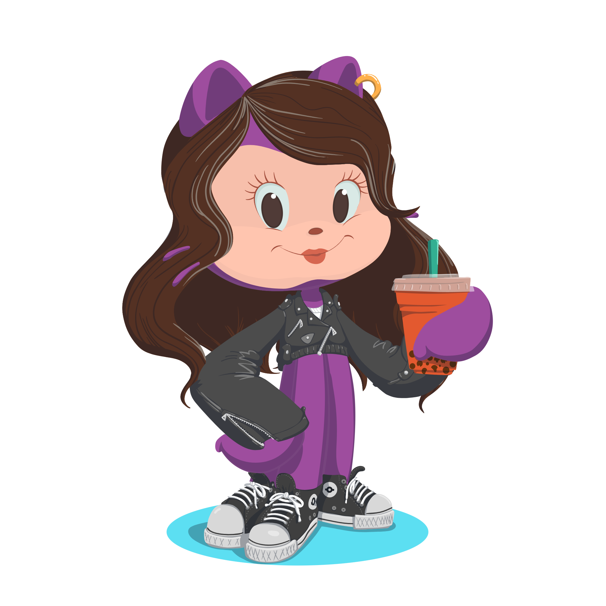

# Hello World! Bem vindos ao meu Github! 👋✨
## Meu nome é *Mariane*, pode me chamar de Mari!

Tenho 23 anos e sou de São Paulo. Atualmente estou em transição de área, sempre estive na área da beleza e também na área de Design. Hoje estou cursando Análise e Desenvolvimento de Sistemas pela FIT - Faculdade Impacta Tecnologia e estou buscando estágio na área. Aqui neste perfil, sigo postando repositórios de estudos e projetos pessoais. Quer colaborar comigo?

## Ferramentas e tecnologias

    
## Estou aprendendo mais sobre

## Uso para minha organização

          
## Contato

    
     
      

<!--
**marianefernandes07/marianefernandes07** is a ✨ _special_ ✨ repository because its `README.md` (this file) appears on your GitHub profile.

Here are some ideas to get you started:

- 🔭 I’m currently working on ...
- 🌱 I’m currently learning ...
- 👯 I’m looking to collaborate on ...
- 🤔 I’m looking for help with ...
- 💬 Ask me about ...
- 📫 How to reach me: ...
- 😄 Pronouns: ...
- ⚡ Fun fact: ...
-->
